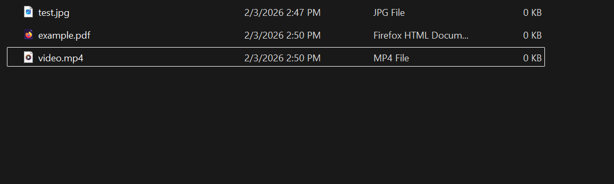
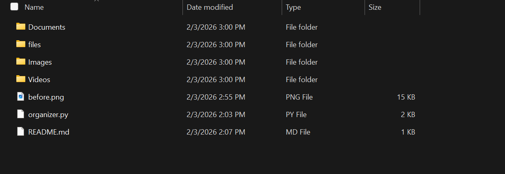

# Python File Organizer

This is a simple Python automation script that organizes files into folders based on their file type.

## Features
- Automatically sorts files into categories
- Supports images, documents, videos, and music
- Easy to customize

## Technologies Used
- Python
- OS & file handling libraries

## How to Use
1. Place files inside the `files` folder
2. Run `python organizer.py`
3. Files will be sorted automatically

## Screenshots

### Before

### After

